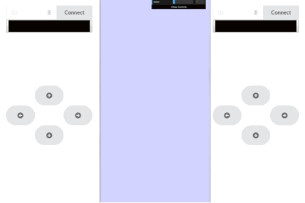

## Mass Control
A class assignment created for users to interact with each other with an interface

## Motivation
Practice websockets, event triggers and handling with jQuery and CoffeeScript.

## Demo / GIF

## Installation
1) Create a new EC2 Cloud 9 instance
2) In Cloud 9 terminal:
	- a) git clone https://github.com/kenh7/module5-mass-control.git
	- b) cd module5-mass-control
	- c) bundle install
3) Run project

## Credits
Originally cloned from https://github.com/CSE3392-S2020/module5-mass-control
